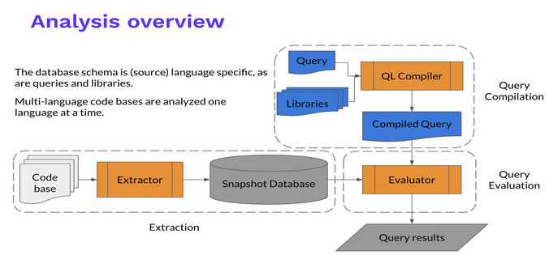

## Refs
 - more about LGTM and QL: https://web.archive.org/web/20190918215933/https://blog.semmle.com/tags/

 - Intro to QL: https://web.archive.org/web/20190918215957/https://blog.semmle.com/interning-at-semmle/

 - Introduction to variant analysis with QL and LGTM (Part 1)
    * ref: https://web.archive.org/web/20190918220017mp_/https://blog.semmle.com/intro_to_variant_analysis_part_1/


## RoadMap learning QL and LGTM

 - installation
    * [codeQL cli Installation](https://codeql.github.com/docs/codeql-cli/getting-started-with-the-codeql-cli/)
    * [codeQL code scanning](https://docs.github.com/en/code-security/code-scanning/using-codeql-code-scanning-with-your-existing-ci-system/configuring-codeql-cli-in-your-ci-system)
    * [codeQL analyzer](https://codeql.github.com/docs/codeql-cli/analyzing-databases-with-the-codeql-cli/)
    * [codeQL for visual studio code](https://codeql.github.com/docs/codeql-for-visual-studio-code/)
    * [Analyzine codeQL database on Visual Studio Code](https://codeql.github.com/docs/codeql-for-visual-studio-code/analyzing-your-projects/#analyzing-your-projects)
    * [CodeQL glossary](https://codeql.github.com/docs/codeql-overview/codeql-glossary/#codeql-database)


---

 - Brief Workshop

    * [CodeQL Live Episode 1 (brief example in C/C++ vulns)](https://www.youtube.com/watch?v=AMzGorD28Ks)

    * [Security: Workshop 2 - Finding security vulnerabilities in C/C++ with CodeQL](https://www.youtube.com/watch?v=eAjecQrfv3o)

    * [Finding security vulnerabilities in C/C++ with CodeQL repo](https://github.com/githubuniverseworkshops/codeql/tree/main/workshop-2020)
    * [workshop.md](https://github.com/githubuniverseworkshops/codeql/blob/main/workshop-2020/workshop.md)
    * [Github security lab resources](https://github.com/github/securitylab)
    * [Github exploits](https://github.com/github/securitylab/tree/main/SecurityExploits)
    * [Famous codeql queries](https://github.com/github/securitylab/tree/main/CodeQL_Queries/cpp)
    * [Apple's XNU Kernel codeQL CVE-2017-13782](https://securitylab.github.com/research/apple-xnu-dtrace-CVE-2017-13782/)
    * [video of xnu kernel vuln found using codeql](https://www.twitch.tv/videos/831625367)
    * [Actions for Learning Lab CodeQL Courses](https://github.com/github/codeql-learninglab-actions)
    * [CodeQL Action](https://github.com/github/codeql-action)
    * [extension for Visual Studio Code that adds rich language support for CodeQL](https://github.com/github/vscode-codeql)
    * [github profile](https://github.com/adityasharad)


 - other workshops
    * [Finding security vulnerabilities in Java with CodeQL - GitHub Satellite 2020](https://www.youtube.com/watch?v=nvCd0Ee4FgE)
    * [Finding security vulnerabilities in JavaScript with CodeQL - GitHub Satellite 2020](https://www.youtube.com/watch?v=pYzfGaLTqC0)

---


 - [QL tutorials](https://codeql.github.com/docs/writing-codeql-queries/ql-tutorials/)
    * [QL detective tutorials](https://web.archive.org/web/20190918215857/https://help.semmle.com/QL/learn-ql/beginner/ql-tutorials.html)
    * [QL training and variant analysis examples](https://web.archive.org/web/20190918215858/https://help.semmle.com/QL/learn-ql/ql-training.html)
    * [demo on aggregator operators](https://codeql.github.com/docs/writing-codeql-queries/find-the-thief/)

 - [Introduction to query files](https://web.archive.org/web/20190918215910/https://help.semmle.com/QL/learn-ql/writing-queries/introduction-to-queries.html)

 - [Basic query for C and C++ code](https://codeql.github.com/docs/codeql-language-guides/basic-query-for-cpp-code/)
    * [CodeQL library for C and C++](https://codeql.github.com/docs/codeql-language-guides/codeql-library-for-cpp/)
    * [codeQL Functions in C and C++](https://codeql.github.com/docs/codeql-language-guides/functions-in-cpp/)
    * [codeQL Expressions, types, and statements in C and C++](https://codeql.github.com/docs/codeql-language-guides/expressions-types-and-statements-in-cpp/)
    * [more here](https://codeql.github.com/docs/codeql-language-guides/refining-a-query-to-account-for-edge-cases/)

 - [Introduction to variant analysis with QL and LGTM (Part 1)](https://web.archive.org/web/20190918220017/https://blog.semmle.com/intro_to_variant_analysis_part_1/)
    * [Part 2](https://web.archive.org/web/20190918215954mp_/https://blog.semmle.com/introduction-to-variant-analysis-part-2/)
    * [Introduction to variant analysis C/C++](https://web.archive.org/web/20190918215957/https://help.semmle.com/QL/ql-training/cpp/intro-ql-cpp.html#1)
    * [Introduction to data flow analysis in QL](https://web.archive.org/web/20190918215858/https://help.semmle.com/QL/learn-ql/intro-to-data-flow.html)
    * [Analyzing data flow in C and C++](https://codeql.github.com/docs/codeql-language-guides/analyzing-data-flow-in-cpp/)

 - [Creating path queries](https://codeql.github.com/docs/writing-codeql-queries/creating-path-queries/#creating-path-queries)

 - [All official training for codeQL cpp](https://github.com/github/codeql/tree/4a8e8fa0de4470aaeed94357f70b54b68c0b84a7/docs/language/ql-training/cpp)


 - extra
    * [codeQL web stuff](https://jorgectf.gitlab.io/blog/post/practical-codeql-introduction/)


 - Exercises [folder](./codeql_exer)


---
---


## Installation

### Intro

 - QL is "analyze source code with a parsing engine and we store it in a special graph representation structure"
    * so we have a programming language QL, interpreted  (object oriented language precisely)
    * LGTM queries those graphes
    * codeQL uses QL as LGTM, but can run in local, meanwhile LGTM is a SaaS

 - LGTM identifies alerts in code using queries written in a specially-designed language: QL.

 - Note: semmleQL was developed by semmle, a developer that now works for github, and so codeQL is the successor

 - How codeQL (ex. Semmle QL) works



 - QL works by creating (or "extracting") a queryable database of your source code, then allowing you to run queries to explore your code, 
   or find variants of known issues. 
    * For compiled languages, Semmle’s tools observe an ordinary build of the source code. 
    * Each time a compiler is invoked, the compiler call is "intercepted," and the extractor is invoked with the same arguments. 
    * This allows the extractor to see precisely the same source code that is compiled to build the program. 

 - The extractor gathers all relevant information about the source code, such as of:
    * the file name, 
    * a representation of the AST, 
    * type information, 
    * information on the operation of the preprocessor, 
    * etc
    
 - Then stores it in a relational database. 
    * For interpreted languages, which have no compilers to incercept, the extractor gathers similar information by running directly on the source code.

 - Once the extraction finishes, all of the relevant information about the project is contained in a single snapshot database, 
   which is then ready to query, possibly on a different machine. 
    * A copy of the source files, made at the time the database was created, is also included in the snapshot so that analysis results can be displayed

 - Queries are written in the QL language and usually depend on one or more of the standard QL libraries
    * you can write your own custom libraries


### codeQL installation

  - Installation, https://codeql.github.com/docs/codeql-cli/getting-started-with-the-codeql-cli/
  - segui le istruzioni, alla fine dovresti avere

```
cd ~/codeql-home

# Run codeql resolve languages to show which languages are available for database creation.
./codeql/codeql resolve languages
...

# Run codeql resolve qlpacks to show which QL packs the CLI can find. 
./codeql/codeql resolve qlpacks
...

# nota: codeql-home/codeql è il folder https://github.com/github/codeql-cli-binaries/releases
# mentre codeql-home/codeql-repo è il folder https://github.com/github/codeql
```


### codeQL scanning

 - codeQL database creation
    * Configuring CodeQL CLI in your CI system, https://docs.github.com/en/code-security/code-scanning/using-codeql-code-scanning-with-your-existing-ci-system/configuring-codeql-cli-in-your-ci-system
    * Database creation, https://codeql.github.com/docs/codeql-cli/creating-codeql-databases/#creating-codeql-databases
    * run
```
# export path bashrc
export PATH="$PATH:~/codeql-home/codeql"

# se il linguaggio è compilato abbiamo bisogno di creare un Makefile con dentro le istruzioni, così che 
# poi possiamo lanciare l'argomento `--command <command>` in questo caso `<command>` sarà `make`

#codeql database create <database> --command=<build>  --db-cluster --language=<language-identifier>,<language-identifier>
#
# - <database> : the name and location of a directory to create for the CodeQL database. 
# --language   : the identifier for the language to create a database for, one of: cpp`, `csharp`, `go`, `java`, `javascript`, `python`, and `ruby 
# --command    : Use to specify the build command or script that invokes the build process for the codebase. Not needed for interp language, e.g. Python 
# --db-cluster : Use in multi-language codebases to generate one database for each language specified by --language.
# --no-run-unnecessary-build : Use to suppress the build command for languages where the CodeQL CLI does not need to monitor the build (for example, Python
#
# --source-root : Use if you run the CLI outside the checkout root of the repository. By default, the database create command assumes current directory is the source files
#                 Nota: non è dove si trova il sorgente del progetto da analizzare, ma dove si trova codeql internal files, etc, quindi ignora questo parametro

# e.g.

# create tmp database folder
cd ~/codeql-home && mkdir codeql-dbs

# create db
cd ~/Development/geo_location
codeql database create ~/codeql-home/codeql-dbs/geo_location --command=make --language=cpp

```


### Analyzing codeQL database
 - ref, https://codeql.github.com/docs/codeql-cli/analyzing-databases-with-the-codeql-cli/
 - To analyze a codebase, you run queries against a CodeQL database extracted from the code.
 - CodeQL analyses produce interpreted results that can be displayed as alerts or paths in source code.
  
 - When you run database analyze operations, they generally do:
    1. Executes one or more query files, by running them over a CodeQL database.
    2. Interprets the results, based on certain query metadata, so that alerts can be displayed in the correct location in the source code.
    3. Reports the results of any diagnostic and summary queries to standard output.

 - You can analyze a database by running the following command:
```
codeql database analyze <database> --format=<format> --output=<output> <queries>

# <database>  : the path to the CodeQL database you want to analyze.
# --format    : the format of the results file generated during analysis. supported, including CSV, SARIF, and graph formats. F
# --output    : the output path of the results file generated during analysis.
#
# You can also specify optionals:
#
# <queries>   : the queries to run over your database. You can 
#                * list one or more individual query files, 
#                * specify a directory that will be searched recursively for query files, 
#                * or name a query suite that defines a particular set of queries. 
#                * If omitted, the default query suite for the language of the database being analyzed will be used
#
# --sarif-category : an identifying category for the results. Used when you want to upload more than one set of results for a commit. 
#
# --sarif-add-query-help : (supported in version 2.7.1 onwards) adds any custom query help written
#
# --threads   : optionally, the number of threads to use when running queries. The default option is 1. 

# e.g.
cd ~/codeql-home/codeql-dbs
codeql database analyze ./geo_location --format=sarif-latest --output=analyese_test.sarif

# otherwise, specify the cpp query (in this case the command's result is the same of the previous one)
cd ~/codeql-home/codeql-dbs
codeql database analyze ./geo_location ../codeql-repo/cpp/ql/src/codeql-suites/cpp-code-scanning.qls --format=sarif-latest --output=analyese_test.sarif

# otherwise, run all queries in a directory¶
cd ~/codeql-home/codeql-dbs
codeql database analyze ./geo_location ../codeql-repo/cpp/ql/src/Likely\ Bugs/ --format=sarif-latest --output=analyese_test.sarif


```

 - please note, The repo/folder `~/codeql-home/codeql-repo` also includes the query suites used by LGTM.com. 
    * These are stored alongside the query suites for code scanning with names of the form: `<language>-lgtm.qls`


### CodeQL for visual studio code
 - download visual studio code (support Linux) https://code.visualstudio.com/docs/setup/linux
 - install it, then execute `$ code` from terminal
 - on extension tab search for 'codeQL' and press install
 - we need to add codeQL databases


### Analyzing codeQL database on Visual Studio Code

 - create the database, then open the workspace associated to the project 
 - go on section `codeQL` and open the database, e.g. we opened the workspace `geo_location`, then import the database `codeql-home/codeql-dbs/geo_location`
 - after so we need to run queries, we go on workspace view, right-click and select `Add folder to workspace` 
    * select the folders from `codeql-home/codeql-repo`


 - Nota: Seleziona il database che vuoi, aggiungi al workspace il folder con le query, tasto destro sul folder query, 'run queries'
    * non c'è bisogno del sorgente basta che ci sia il database, cool

 - Nota: disabilita update automatico codeQL da visual studio altrimenti devi ogni volta riaggiorane ~/codeql-home/codeql folder


### Testing CodeQL queries in Visual Studio Code

 - we could have issues using query on visual code, ref https://codeql.github.com/docs/codeql-for-visual-studio-code/testing-codeql-queries-in-visual-studio-code/

 - to test custom queries we need to create a qlpack.yml file, ref https://codeql.github.com/docs/codeql-cli/testing-custom-queries/#testing-custom-queries


## QL tutorials

### Introduction to the QL language

 - ref: https://web.archive.org/web/20190918215914/https://help.semmle.com/QL/learn-ql/introduction-to-ql.html
 - ref: https://codeql.github.com/docs/writing-codeql-queries/introduction-to-ql/

 - QL is a powerful query language that is used to analyze code. 
 - Queries written in QL can be used to find errors and uncover variants of important security vulnerabilities. 


 - Basic syntax
    * The basic syntax will look familiar to anyone who has used SQL, but it is used somewhat differently
    * QL is a logic programming language, so it is built up of logical formulas. 
    * QL uses common logical connectives (such as and, or, and not), quantifiers (such as forall and exists), and other important logical concepts such as predicates.
    * QL also supports recursion and aggregates. This allows you to write complex recursive queries using simple QL syntax 
      and directly use aggregates such as count, sum, and average.


### QL in a nutshell

 - QL is:
    * a logic language based on first-order logic
    * a declarative language without side effects
    * an object-oriented language
    * a query language working on a read-only snapshot database
    * equipped with rich standard libraries for program analysis


### Basic query structure

 - Queries written in QL have the file extension .ql, and contain a select clause. 
    * Many of the built-in Semmle queries include additional optional information, and have the following structure:
```ql
/**
 *
 * Query metadata
 *
*/

import /* ... QL libraries or modules ... */

/* ... Optional, define QL classes and predicates ... */

from /* ... variable declarations ... */
where /* ... logical formula ... */
select /* ... expressions ... */

```

 - Query metadata: is used to identify your custom queries when they are added to the Semmle repository or used in your analysis
    * Metadata provides information about the query’s purpose, and also specifies how to interpret and display the query results
    * more here: https://web.archive.org/web/20190918215900/https://help.semmle.com/QL/learn-ql/writing-queries/query-metadata.html


### QL and variant analysis

 - Variant analysis is the process of using a known vulnerability as a seed to find similar problems in your code. 
 - Security engineers typically perform variant analysis to identify possible vulnerabilities and to ensure that these threats are properly fixed 
   across multiple code bases.

 - QL is Semmle’s variant analysis engine, and it is also the technology that underpins LGTM, Semmle’s community driven security analysis platform. 
    * Together, QL and LGTM provide continuous monitoring and scalable variant analysis for your projects, 
    * even if you don’t have your own team of dedicated security engineers. You can read more about using QL and LGTM in variant analysis in the Semmle blog.

 - [more here](#variant-analysis-ql-c)


### Demo-1

 - go to https://lgtm.com/query/480729629812871502/
    * select C/C++ language
    * select demo repo
    * then run query, e.g.
```
import cpp
                       // comment 1
                       /* comment 2 */
select "hello world"   // This query simply returns the string "hello world".
```

 - More complicated queries typically look like this:
```
 from /* ... variable declarations ... */
 where /* ... logical formulas ... */
 select /* ... expressions ... */
```

 - For example, the result of this query is the number 42:
```
 from int x, int y
 where x = 6 and y = 7
 select x * y
```

 - Example, calc a pythagorean triples
```
from int x, int y, int z
where x in [1..10] and y in [1..10] and z in [1..10] and
      x*x + y*y = z*z
select x, y, z

```


 - We could make the previous example even more sophisticated, we can declare classes
```
class SmallInt extends int {
    SmallInt() { this in [1..10] }      // constructor (we use behavioral programming, so we match if the class inherit this property)
    int square() { result = this*this } // method class, result is a special keyword
}

from SmallInt x, SmallInt y, SmallInt z
where x.square() + y.square() = z.square()
select x, y, z
```


 - Example in python
    * query functions

```
import python

from Function f                 // 'f' representing a function
where count(f.getAnArg()) > 7   // match 'f's accepting more than 7 args
select f                        // print out results
```


 - Example in Javascript
    * query comments

```
import javascript

from Comment c
where c.getText().regexpMatch("(?si).*\\bTODO\\b.*")
select c
```


 - Example in Java
    * query parameters

```
import java

from Parameter p
where not exists(p.getAnAccess())
select p
```


### Demo on aggregator operators

 - Common aggregates are count, max, min, avg (average) and sum
    * `<aggregate>(<variable declarations> | <logical formula> | <expression>)`

 - E.g. advanced query
    * max aggregate to find the age of the oldest person in the village:

```
from Person t
where t.getAge() = max(int i | exists(Person p | p.getAge() = i) | i)
select t
```


## Query files
 - A query file has the extension .ql and contains a query clause, and optionally predicates, classes, and modules.
 - A query library has the extension .qll and does not contain a query clause, but may contain modules, classes, and predicates.
    * Each query library also implicitly defines a module.

 - Three important types of query are:
    * Alert queries: queries that highlight issues in specific locations in your code.
    * Path queries: queries that describe the flow of information between a source and a sink in your code.
    * Metric queries: queries that compute statistics for your code.


## Basic query for C and C++ code


### codeQL Functions in C and C++

 - to find classes ref to: https://codeql.github.com/docs/codeql-language-guides/codeql-library-for-cpp/
    * Function: class representing a function/method on C
    * FunctionCall: A C/C++ function call where the name of the target function is known at compile-time.
    * FunctionAccess: functions that are referenced with a function pointer
 
 - Also classes can be found here https://codeql.github.com/codeql-standard-libraries/cpp/semmle/code/cpp/Function.qll/type.Function$FunctionDeclarationEntry.html

 - Note: with visual studio if we point the mouse on a class declaration it will pop up the doc
    * To pop-up details of a class' method we select `<class>.<method>`


 - Finding all static functions: Using the member predicate Function.isStatic() we can list all the static functions in a database:
```
import cpp

from Function f
where f.isStatic()
select f, "This is a static function."
```


 - Finding functions that are not called: It might be more interesting to find functions that are not called
    * using the standard CodeQL FunctionCall class from the abstract syntax tree category (see CodeQL libraries for C and C++). 
    * The FunctionCall class can be used to identify places where a function is actually used, 
      and it is related to Function through the FunctionCall.getTarget() predicate.
```
import cpp

from Function f
where not exists(FunctionCall fc | fc.getTarget() = f)
select f, "This function is never called."
```


 - Excluding functions that are referenced with a function pointer
```
import cpp

from Function f
where not exists(FunctionCall fc | fc.getTarget() = f)
  and not exists(FunctionAccess fa | fa.getTarget() = f)
select f, "This function is never called, or referenced with a function pointer."
```


### codeQL Expressions, types, and statements in C and C++

 - Finding assignments to zero
    * In the following example we find instances of AssignExpr which assign the constant value zero:
```
import cpp

from AssignExpr e
where e.getRValue().getValue().toInt() = 0
select e, "Assigning the value 0 to something."

```


#### Statements in CodeQL

 - We can refine the query further using statements. In this case we use the class ForStmt:

 - Stmt - C/C++ statements

    * Loop
       > WhileStmt
       > ForStmt
       > DoStmt

    * ConditionalStmt
       > IfStmt
       > SwitchStmt

    * TryStmt
    * ExprStmt - expressions used as a statement; for example, an assignment
    * Block - { } blocks containing more statements


#### Conversions and classes in C and C++
 - In C and C++, conversions change the type of an expression. They may be implicit conversions generated by the compiler, or explicit conversions requested by the user.
 - ref: https://codeql.github.com/docs/codeql-language-guides/conversions-and-classes-in-cpp/

 - Exploring the subexpressions of an assignment
```
import cpp

from AssignExpr a
select a, a.getLValue().getType(), a.getRValue().getType()
```

### more here 
 - ref, https://codeql.github.com/docs/codeql-language-guides/refining-a-query-to-account-for-edge-cases/


## Intro to variant analysis in codeQL


### what is variant analysis?
 - The structures, languages, etc. change, but most of the mistakes are similar
 - Whenever a security vulnerability is discovered (whether through security research, during code review, through a bug bounty program, or by any other process), 
   we are presented with an opportunity.
    * We should investigate how often the mistake is repeated, determine whether there are any other similar vulnerabilities in the codebase, 
    * and implement a process to prevent the mistake from happening again.

```
 [ security bug ] ---> [ Diagnose ] ---> [ Discover variants ] ---> [ Prevent future bugs ]
```

 - Variant analysis is the process of taking an existing vulnerability, finding the root cause, and searching for variants of the problem in a codebase. 


### How do we go about finding variants?
 - The most common automated security research techniques used today include 
    * regression testing, 
    * unit testing, 
    * and fuzzing
    * none of these methods are optimal for finding variants of known vulnerabilities

 - Luckily, there is a resource available that can automate much of the heavy lifting of variant analysis, 
   removing the need to manually comb through source code, and sharing security knowledge and best practices.


#### Example CVE-2018-15686 (fgets systemd)
 - It was discovered that systemd was vulnerable to a state injection attack when line splitting via fgets()
 - example to target fgets

```
import cpp

predicate dangerousFunction(Function function) {
  exists (string name | name = function.getQualifiedName() |
    name = "fgets")
}

from FunctionCall call, Function target
where call.getTarget() = target
  and dangerousFunction(target)
select call, target.getQualifiedName() + " is potentially dangerous"
```

#### example sprintf unsafe

 - Finding a specific function
    * This query uses Function and FunctionCall to find calls to the function sprintf that have a variable format string—which is potentially a security hazard.
```
import cpp

from FunctionCall fc
where fc.getTarget().getQualifiedName() = "sprintf"
  and not fc.getArgument(1) instanceof StringLiteral
select fc, "sprintf called with variable format string."
```


####  Iterative query refinement

 - example sprintf unsafe, in this case we search for possible buffer overflow
 - Find all sprintf calls
```
import cpp

from FunctionCall call
where call.getTarget().getName() = "sprintf"
select call, "potentially dangerous call to sprintf."
```

 - QL makes it very easy to experiment with analysis ideas. 
 - A common WORKFLOW is to start with a simple query (like our query to find calls to snprintf), examine a few results, and refine the query 
    * based on any patterns that emerge, and repeat.

 - e.g. supposing our previous query found 173 results. Checking the seriousness of each of these results manually would be a time-intensive and error-prone task. 
    * Instead, we can refine our query based on the observation that only calls to sprintf with %s in the format specifier are likely to be vulnerable

```
import cpp

from FunctionCall call
where call.getTarget().getName() = "sprintf"
  and call.getArgument(1) instanceof StringLiteral                // the 1-arg is a constant string
  and call.getArgument(1).getValue().regexpMatch("(?s).*%s.*")    // the 1-arg should contain %s
select call, "potentially dangerous snprintf."
```

 - NOTE: In pre-C99 versions of glibc snprintf would return -1 if n was too small!

 - example on snprintf
```
import cpp

from FunctionCall call
where call.getTarget().getName() = "snprintf"
  and call.getArgument(2) instanceof StringLiteral                // the 2-arg is a constant string
  and call.getArgument(2).getValue().regexpMatch("(?s).*%s.*")    // the 2-arg should contain %s
select call, "potentially dangerous snprintf."
```

####  Iterative query refinement (part 2)

 - The previous query gives back 102 results, to refine we use taint-tracking, that is part of the data-flow analysis codeQL part

 - refer to [dataflow-example-snprintf](#dataflow-example-snprintf)


### Variant analysis QL (again)
 - Variant analysis QL for C/C++
 - ref: https://help.semmle.com/QL/ql-training/cpp/intro-ql-cpp.html

 - example 1
    * Find functions that write more-over the buffer

```
import cpp

from Function f, FunctionCall c, int i, int a, int b
where f = c.getTarget()
  and a = c.getArgument(i).getType().(ArrayType).getArraySize()     // Nota, per chiamare metodo ho bisogno di fare casting di object
  and b = f.getParameter(i).getType().(ArrayType).getArraySize()
  and a < b
select c.getArgument(i), "Array of size " + a
       + " passed to $@, which expects an array of size " + b + ".",
       f, f.getName()
```

 - example 2
    * In the previous example we find array overflow on static memory(maybe)
    * If we want to find "if" condition with empty code block?
```
import cpp  
   
from IfStmt ifstmt, Block block
where
  block = ifstmt.getThen() and
  block.isEmpty()
select ifstmt, "This if-statement is redundant."
```

 - example 3 (Predicate)
    * Previous example with method returning predicate
```
import cpp

predicate isEmpty(Block block) {
    block.isEmpty()
}

from IfStmt ifstmt
where isEmpty(ifstmt.getThen())
select ifstmt, "This if-statement is redundant."
```

 - example 4 (Class)
    * previous example with class and method integrated
    * Member predicates are inherited and can be overridden.
 - Please note, the constructor is a characteristic predicate; 
    * it contains the values that belong to all supertypes and satisfy the characteristic predicate, if provided.
```
import cpp

class EmptyBlock extends Block {
  EmptyBlock() {
    this.isEmpty()
  }
}

from IfStmt ifstmt
where ifstmt.getThen() instanceof EmptyBlock        // match class objects that are also instance of EmptyBlock, the constructor/characteristic predicate tells us
select ifstmt, "This if-statement is redundant."

```


### Data flow QL

 - refs:
    * https://web.archive.org/web/20190918215858/https://help.semmle.com/QL/learn-ql/intro-to-data-flow.html
    * https://codeql.github.com/docs/codeql-language-guides/analyzing-data-flow-in-cpp/


#### Data flow graph
 - The QL data flow libraries implement data flow analysis on a program or function by modeling its data flow graph. 
 - Unlike AST the data flow graph does not reflect the syntactic structure of the program, but models the way data flows through the program at runtime. 
    * Nodes in the abstract syntax tree represent syntactic elements such as statements or expressions. 
    * Nodes in the data flow graph, on the other hand, represent semantic elements that carry VALUES at runtime.

 - Edges in the data flow graph represent the way data flows between program elements. For example, in the expression x || y there are:
    * data flow nodes corresponding to the sub-expressions x and y, 
    * as well as a data flow node corresponding to the entire expression x || y.

 - Local and global data flow differ in which edges they consider
    * interprocedural (function graphes)
    * intraprocedural (basic block graphes of the same function)
 
 - The consequence of local and global data is that we define query on two type of results:
    * Local data flow, concerning the data flow within a single function. 
    * Global data flow, effectively considers the data flow within an entire program, by calculating data flow between functions and through object properties. 
       > Computing global data flow is more time,energy intensive than local, therefore queries should be refined to look for more specific sources and sinks.

 - The data flow graph is computed using CLASSES to model the program elements that represent the GRAPH’S NODES. 
    * The flow of data between the nodes is modeled using PREDICATES to compute the GRAPH’S EDGES.


#### Normal data flow vs taint tracking

 - The normal data flow libraries are used to analyze the information flow in which data values are preserved at each step.
    * For example, if you are tracking an insecure object x, a step in the program may ‘change’ its value. 
    * So, in a simple process such as y = x + 1, a normal data flow analysis will highlight the use of x, but not y. 
    * However, since y is derived from x, it is influenced by the untrusted or ‘tainted’ information, and therefore it is also tainted. 

 - Analyzing the flow of the taint from x to y is known as taint tracking.
 - In QL, taint tracking extends data flow analysis by including steps in which the data values are not necessarily preserved, but the potentially insecure object 
   is still propagated. These flow steps are modeled in the taint-tracking library using predicates that hold if taint is propagated between nodes.


#### Data-flow summary ql

 - QL has extensive support for writing data-flow and taint-tracking queries: 
    * simply define the sources, sinks and sanitization steps, and the data-flow libraries will do the rest of the work, 
    * showing you the (source, sink) pairs where data flows from one to the other.

 - However, just having the list of sources and sinks is often not quite enough information.
    * Paths between the sources and sinks can often be highly complex, and involve many different files. 
    * As a result, it can be hard to see how a particular result pair was produced, and to verify and fix the problem.

 - Now it is possible to explore these paths directly in LGTM (or codeQL)


#### Using local data flow

 - The local data flow library is in the module DataFlow, which defines the class Node denoting any element that data can flow through. 
 - Nodes are divided into :
    * expression nodes (ExprNode) 
    * parameter nodes (ParameterNode) 

 - expression nodes:
```
Class Expr

An expression.

Examples:

x + 1
y < 0
```

 - parameter nodes:
```
Class Parameter

A (named) function parameter.

Note that receiver variables are considered parameters.
```


 - It is possible to map between data flow nodes and expressions/parameters using the member predicates asExpr and asParameter:
```
class Node {
  /** Gets the expression corresponding to this node, if any. */
  Expr asExpr() { ... }

  /** Gets the parameter corresponding to this node, if any. */
  Parameter asParameter() { ... }

  ...
}

// or using the predicates exprNode and parameterNode:

/**
 * Gets the node corresponding to expression `e`.
 */
ExprNode exprNode(Expr e) { ... }

/**
 * Gets the node corresponding to the value of parameter `p` at function entry.
 */
ParameterNode parameterNode(Parameter p) { ... }

```

 - The predicate localFlowStep(Node nodeFrom, Node nodeTo) holds if there is an immediate data flow edge from the node nodeFrom to the node nodeTo. 
    * The predicate can be applied recursively (using the + and * operators), 
    * or through the predefined recursive predicate localFlow, which is equivalent to `localFlowStep*`.

 - For example, finding flow from a parameter source to an expression sink in zero or more local steps can be achieved as follows:
```
DataFlow::localFlow(DataFlow::parameterNode(source), DataFlow::exprNode(sink))
```


#### Using local taint tracking

 - Local taint tracking extends local data flow by including non-value-preserving flow steps
 - The local taint tracking library is in the module TaintTracking. 
 - Like local data flow, a predicate localTaintStep(DataFlow::Node nodeFrom, DataFlow::Node nodeTo) holds if there is an immediate taint propagation edge 
   from the node nodeFrom to the node nodeTo. 
    * The predicate can be applied recursively (using the + and * operators), 
    * or through the predefined recursive predicate localTaint, which is equivalent to `localTaintStep*`.

 - For example, finding taint propagation from a parameter source to an expression sink in zero or more local steps can be achieved as follows:
```
TaintTracking::localTaint(DataFlow::parameterNode(source), DataFlow::exprNode(sink))
```

 - example: The following query finds the filename passed to fopen.
```
import cpp

from Function fopen, FunctionCall fc
where fopen.hasQualifiedName("fopen")
  and fc.getTarget() = fopen
select fc.getParameter(0)
```

 - example: The example will only give the expression in the argument, not the values which could be passed to it.
    * So we use local data flow to find all expressions that flow into the argument:
```
import cpp
import semmle.code.cpp.dataflow.DataFlow

from Function fopen, FunctionCall fc, Expr src
where fopen.hasQualifiedName("fopen")
  and fc.getTarget() = fopen
  and DataFlow::localFlow(DataFlow::exprNode(src), DataFlow::exprNode(fc.getArgument(0)))
select src
```

 - Then we can vary the source, for example an access to a public parameter. The following query finds where a public parameter is used to open a file:
    * credo intenda che in questo caso cerchiamo l'argomento preso dall'utente

```
import cpp
import semmle.code.cpp.dataflow.DataFlow

from Function fopen, FunctionCall fc, Parameter p
where fopen.hasQualifiedName("fopen")
  and fc.getTarget() = fopen
  and DataFlow::localFlow(DataFlow::parameterNode(p), DataFlow::exprNode(fc.getArgument(0)))
select p
```

 - The following example finds calls to formatting functions where the format string is not hard-coded. (ignora, si può fare anche con regex)
    * in questo caso è comodo perché prende tutti i tipi di printf, fprintf, sprintf, ...
```
import semmle.code.cpp.dataflow.DataFlow
import semmle.code.cpp.commons.Printf

from FormattingFunction format, FunctionCall call, Expr formatString
where call.getTarget() = format
  and call.getArgument(format.getFormatParameterIndex()) = formatString
  and not exists(DataFlow::Node source, DataFlow::Node sink |
    DataFlow::localFlow(source, sink) and
    source.asExpr() instanceof StringLiteral and
    sink.asExpr() = formatString
  )
select call, "Argument to " + format.getQualifiedName() + " isn't hard-coded."
```


##### Dataflow Example snprintf

 - The previous query gives back 102 results, to refine we use taint-tracking, that is part of the data-flow analysis codeQL part
 - Look for calls to snprintf whose return values flow back into their size arguments

```
import cpp
import semmle.code.cpp.dataflow.TaintTracking

from FunctionCall call
where call.getTarget().getName() = "snprintf"
  and call.getArgument(2).getValue().regexpMatch("(?s).*%s.*")
  and TaintTracking::localTaint(DataFlow::exprNode(call), DataFlow::exprNode(call.getArgument(1)))
select call, "potentially dangerous call to snprintf."
```

 - Now if the size is checked before re-call to snprintf we have false positive
    * We can further refine our query to exclude cases where a check like this is already in place.

```ql
import cpp
import semmle.code.cpp.dataflow.TaintTracking
import semmle.code.cpp.controlflow.Guards

from FunctionCall call
where call.getTarget().getName() = "snprintf"
  and call.getArgument(2).getValue().regexpMatch("(?s).*%s.*")
  and TaintTracking::localTaint(DataFlow::exprNode(call), DataFlow::exprNode(call.getArgument(1)))

  // Exclude cases where it seems there is a check in place
  and not exists(GuardCondition guard, Expr operand |

      // Whether or not call is called is controlled by this guard 
      guard.controls(call.getBasicBlock(), _) and

      // operand is one of the values compared in the guard
      guard.(ComparisonOperation).getAnOperand() = operand and

      // the operand is derrived from the return value of the call to snprintf 
      TaintTracking::localTaint(DataFlow::exprNode(call), DataFlow::exprNode(operand))
  )
select call

```

##### Local dataflow Exercises

 - Exercise 1: Write a query that finds all hard-coded strings used to create a host_ent via gethostbyname, using local data flow.


#### Using Global data flow

 - Global data flow tracks data flow throughout the entire program, and is therefore more powerful than local data flow. 
    * However, global data flow is less precise than local data flow, and the analysis typically requires significantly more time and memory to perform.

 - Note: You can model data flow paths in CodeQL by creating path queries. 
    * To view data flow paths generated by a path query in CodeQL for VS Code, you need to make sure that it has the correct metadata and select clause. 
    * For more information, see below [creating path queries](#creating-path-queries)

 - The global data flow library is used by extending the class DataFlow::Configuration as follows:
```
import semmle.code.cpp.dataflow.DataFlow

class MyDataFlowConfiguration extends DataFlow::Configuration {
  MyDataFlowConfiguration() { this = "MyDataFlowConfiguration" }

  override predicate isSource(DataFlow::Node source) {
    ...
  }

  override predicate isSink(DataFlow::Node sink) {
    ...
  }
}
```

 - The following predicates are defined in the configuration:
    * isSource  : defines where data/taint may flow from
    * isSink    : defines where data/taint may flow to
    * isBarrier/isSanitizer                       : optional, restricts the data/taint flow
    * isBarrierGuard/isSanitizerGuard             : optional, restricts the data flow
    * isAdditionalFlowStep/isAdditionalTaintStep  : optional, adds additional flow/taint steps

 - The characteristic predicate MyDataFlowConfiguration() defines the name of the configuration, 
    * so "MyDataFlowConfiguration" should be replaced by the name of your class.

 - The data flow analysis is performed using the predicate hasFlow(DataFlow::Node source, DataFlow::Node sink):
```
from MyDataFlowConfiguration dataflow, DataFlow::Node source, DataFlow::Node sink
where dataflow.hasFlow(source, sink)
select source, "Data flow to $@.", sink, sink.toString()
```


#### Using Global data flow

 - Global taint tracking extends global data flow with additional non-value-preserving steps. 
 - The global taint tracking library is used by extending the class TaintTracking::Configuration as follows:
```
import semmle.code.cpp.dataflow.TaintTracking

class MyTaintTrackingConfiguration extends TaintTracking::Configuration {
  MyTaintTrackingConfiguration() { this = "MyTaintTrackingConfiguration" }

  override predicate isSource(DataFlow::Node source) {
    ...
  }

  override predicate isSink(DataFlow::Node sink) {
    ...
  }
}
```

 - The following data flow configuration tracks data flow from environment variables to opening files in a Unix-like environment:
```
import semmle.code.cpp.dataflow.DataFlow

class EnvironmentToFileConfiguration extends DataFlow::Configuration {
  EnvironmentToFileConfiguration() { this = "EnvironmentToFileConfiguration" }

  override predicate isSource(DataFlow::Node source) {
    exists (Function getenv |
      source.asExpr().(FunctionCall).getTarget() = getenv and
      getenv.hasQualifiedName("getenv")
    )
  }

  override predicate isSink(DataFlow::Node sink) {
    exists (FunctionCall fc |
      sink.asExpr() = fc.getArgument(0) and
      fc.getTarget().hasQualifiedName("fopen")
    )
  }
}

from Expr getenv, Expr fopen, EnvironmentToFileConfiguration config
where config.hasFlow(DataFlow::exprNode(getenv), DataFlow::exprNode(fopen))
select fopen, "This 'fopen' uses data from $@.",
  getenv, "call to 'getenv'"
```


##### Global dataflow Exercises

 - Exercise 2: Write a query that finds all hard-coded strings used to create a host_ent via gethostbyname, using global data flow.
 - Exercise 3: Write a class that represents flow sources from getenv.
 - Exercise 4: Using the answers from 2 and 3, write a query which finds all global data flows from getenv to gethostbyname.

 - other solutions here: https://codeql.github.com/docs/codeql-language-guides/analyzing-data-flow-in-cpp/#exercise-1


### Creating path queries 
 - #TODO
 - ref:
    * https://codeql.github.com/docs/writing-codeql-queries/creating-path-queries/#creating-path-queries
    * https://web.archive.org/web/20190918215900/https://help.semmle.com/QL/learn-ql/writing-queries/path-queries.html

 - Path queries written in QL are particularly useful for analyzing data flow, used to track the path taken by a variable (source) to end vulnerable points (sink). 
    * To model paths in QL, your query must provide information about the source and the sink, as well as the data flow steps that link them.


#### Analyzing data flow in C and C++
 - #TODO
 - ref, https://codeql.github.com/docs/codeql-language-guides/analyzing-data-flow-in-cpp/#analyzing-data-flow-in-cpp


### Refining a query to account for edge cases
 - #TODO
 - ref, https://codeql.github.com/docs/codeql-language-guides/refining-a-query-to-account-for-edge-cases/


### QL Training C/C++
 - #TODO
 - ref, https://github.com/github/codeql/tree/4a8e8fa0de4470aaeed94357f70b54b68c0b84a7/docs/language/ql-training/cpp
 - We write below the examples

#### Bad overflow guard
 - ref, https://github.com/github/codeql/blob/4a8e8fa0de4470aaeed94357f70b54b68c0b84a7/docs/language/ql-training/cpp/bad-overflow-guard.rst
 - We split the task in two:
    * Developing a QL query
    * Finding bad overflow guards


 - put integer overflow guards of the form "v + b < v"
    * use classes AddExpr, Variable, RelationalOperation

```ql
import cpp

from AddExpr a, Variable v, RelationalOperation cmp
where
  a.getAnOperand() = v.getAnAccess() and
  cmp.getAnOperand() = a and
  cmp.getAnOperand() = v.getAnAccess()
select cmp, "Overflow check."
```

 - We want to ensure the operands being added have size less than 4 bytes.
    * Looking at autocomplete suggestions, we see that we can get the type of an expression using the getType() method.
    * We can get the size (in bytes) of a type using the getSize() method.

```ql
 predicate isSmall(Expr e) {
     e.getType().getSize() < 4
 }
```

 - We can ensure the operands being added have size less than 4 bytes, using our new predicate.
    * QL has logical quantifiers like exists and forall, allowing us to declare variables and enforce a certain condition on them.

```ql
import cpp

from AddExpr a, Variable v, RelationalOperation cmp
where
  a.getAnOperand() = v.getAnAccess() and
  cmp.getAnOperand() = a and
  cmp.getAnOperand() = v.getAnAccess() and
  forall(Expr op | op = a.getAnOperand() | isSmall(op))
select cmp, "Bad overflow check."

```

 - Sometimes the result of the addition is cast to a small type of size less than 4 bytes, preventing automatic widening. 
    * We don’t want our query to flag these instances.
    * We can use predicate Expr.getExplicitlyConverted() 

```ql
import cpp

predicate isSmall(Expr e) { e.getType().getSize() < 4 }

from AddExpr a, Variable v, RelationalOperation cmp
where
  a.getAnOperand() = v.getAnAccess() and
  cmp.getAnOperand() = a and
  cmp.getAnOperand() = v.getAnAccess() and
  forall(Expr op | op = a.getAnOperand() | isSmall(op)) and
  not isSmall(a.getExplicitlyConverted())
select cmp, "Bad overflow check"
```


### TODO

 - follow workshop section and try following the material [listed](#roadMap-learning-ql-and-lgtm), point `Brief Workshop`


